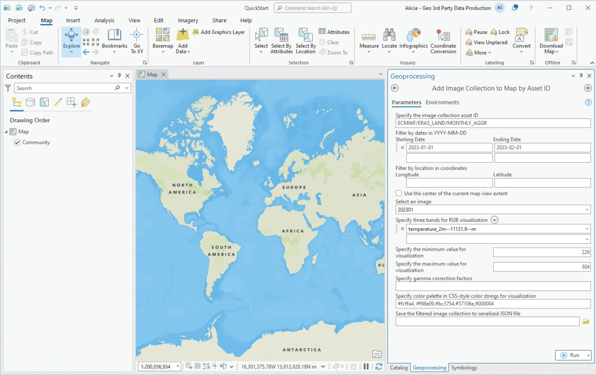

# ArcGIS Earth Engine Toolbox User Guide: Quick Start
Guide to get you up and running with the ArcGIS Earth Engine Toolbox

## Installation

Before using the toolbox, ensure you have the following:

1. ArcGIS Pro 3.2 or later installed on your computer with a license.
2. Google Earth Engine API enabled for your Google Cloud project.
3. Google Cloud SDK installed on your computer.
4. ArcGIS Earth Engine toolbox downloaded from this repo and added to your ArcGIS Pro project. 

Follow the instructions on the [installation page](https://github.com/gee-community/arcgis-earthengine-toolbox/blob/alisul/march_docs/docs/03%20Installation.md) for a step-by-step guide.

## Authenticate Earth Engine from ArcGIS Pro

Once you have completed the installation, you will need to:
1. [Authenticate Earth Engine](https://github.com/gee-community/arcgis-earthengine-toolbox/blob/alisul/march_docs/docs/04%20Authentication%20Tools.md#authenticate-earth-engine) - note this is only needed once per computer.
2. [Initialize Earth Engine](https://github.com/gee-community/arcgis-earthengine-toolbox/blob/alisul/march_docs/docs/04%20Authentication%20Tools.md#initialize-earth-engine)
> [!IMPORTANT]
> Initalize Earth Engine will need to be run each time ArcGIS Pro is started. 

## Where to find Earth Engine Assets to use with this toolbox
Earth Engine assets are geospatial data stored within the platform. You can access datasets in catalogs, or upload your own data and store data produced from your Earth Engine analyses as assets.

* [Earth Engine Data Catalog](https://developers.google.com/earth-engine/datasets/) this is the primary source for public Earth Engine assets and is maintained by Google and contributing publishers.
* [Awesome GEE Community Catalog](https://gee-community-catalog.org/) is a community sourced and maintained data catalog that lives alongside the Earth Engine Data Catalog.
* Organizational or private assets - your orgainzation use Earth Engine, assests can be shared across users. Learn more about [assets](https://developers.google.com/earth-engine/guides/manage_assets)

## Visualize data from the Earth Engine Catalog
The Data Exploration tools provide multiple ways Earth Engine assests into your project to to visualize. Visualization of Earth Engine assets can be helpful to add context to an analysis. Assets brought into ArcGIS Pro with these tools are **read only**. 

### Add an ImageCollection() to your ArcGIS project
1. Starting at the catalog's [main page](https://developers.google.com/earth-engine/datasets) search or navigate to the asset of interest. For this example, we are using the [ERA5-Land Monthly Aggregated](https://developers.google.com/earth-engine/datasets/catalog/ECMWF_ERA5_LAND_MONTHLY_AGGR) asset.

2. Add the image collection asset id and other desired parameters to the [Add Image Collection to Map by Asset ID tool](https://github.com/gee-community/arcgis-earthengine-toolbox/blob/aSullivan-geo-doc-updates/docs/05%20Data%20Exploration%20Tools.md#add-image-collection-to-map-by-asset-id)

4. Click "run" at the bottom of the tool GUI, and the resulting layer will be displayed in the map of your project.

