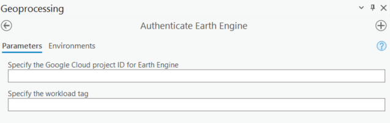
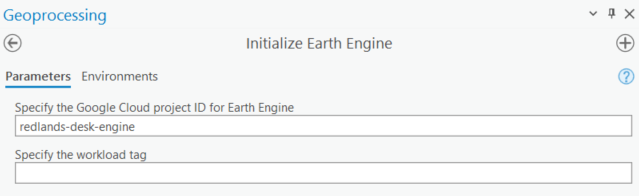

# ArcGIS Earth Engine Toolbox User Guide: Authentication tools
These tools help you get connected to your cloud project and Earth Engine.

## Authenticate Earth Engine

This script authenticates the use of Google Earth Engine with provided Google account. 
>[!TIP]
>The user only needs to run this script once on the same computer. 

The project ID and workload tag are optional inputs here. If the user inputs the project ID, the script will also initialize the Earth Engine.  The user can define them in the "Initialize Earth Engine" script later. To use Earth Engine, you'll need access to a Cloud project that:

1.	has the Earth Engine API enabled, refer to [this link](https://developers.google.com/earth-engine/guides/access) for more information.
2.	is registered for commercial or noncommercial use. Earth Engine, Google's geospatial science platform in Google Cloud, is **available for paid commercial use and remains free for academic and research use.** Refer to [this link](https://console.cloud.google.com/earth-engine) to register for commercial use or noncommercial use.
3.	grants you (or the user) the correct roles and permissions.

Please note that if you have installed Google Cloud SDK shell and set up the application default credentials, this script will authenticate Earth Engine using the quota project ID in the `application_default_credentials.json` usually located at `C:\Users\user_name\AppData\Roaming\gcloud`. If you don't have Google Cloud SDK shell, the script will authenticate through the web browser. 

### Parameters
 1. Google Cloud project ID (Optional)
 2. Wrokload tag (Optional)

## Check or Change Project ID 

This script displays the current Google Cloud quota project ID and allows users to switch quota project ID and workload tag associated with Google Earth Engine if needed. 

Please note that if you have installed Google Cloud SDK shell, you cannot switch quota project ID using this script. Instead, open the Google Cloud SDK shell, copy and paste the following command `gcloud auth application-default set-quota-project QUOTA_PROJECT_ID`, replace the `QUOTA_PROJECT_ID` with your target project ID.

### Parameters
 1. Current project ID (automatically displays)
 2. Current workload tag (automatically displays)
 3. New project ID (Optional)
 4. New workload tag (Optional)  

  
## Initialize Earth Engine 
The script initialize the use of Google Earth Engine with a project ID and workload tag. The user must assign a project ID to use Earth Engine. **The user will need to run this script every time they start the ArcPro.**  

### Parameters 
 1. Google Cloud project ID 
 2. Workload tag (Optional)
