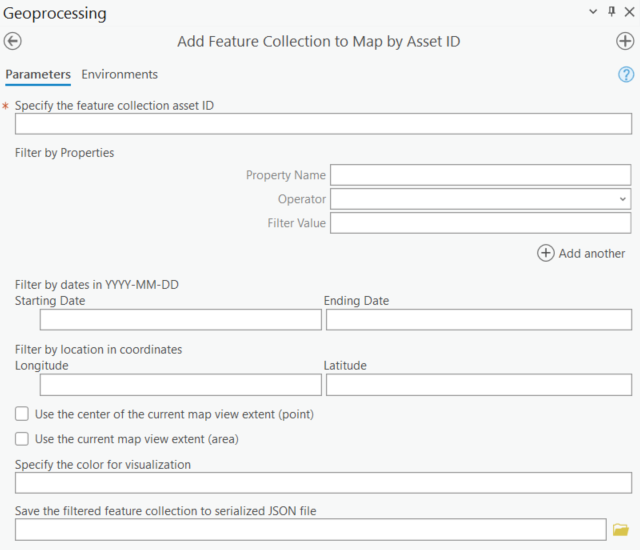
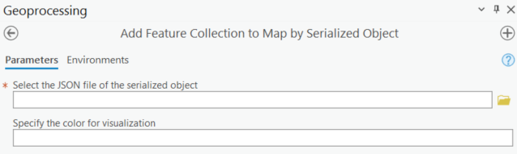
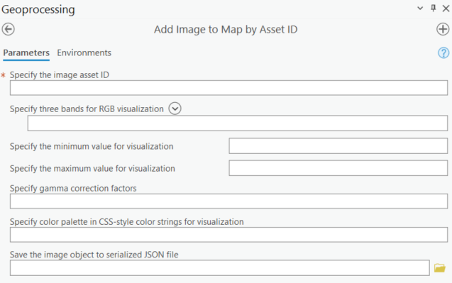
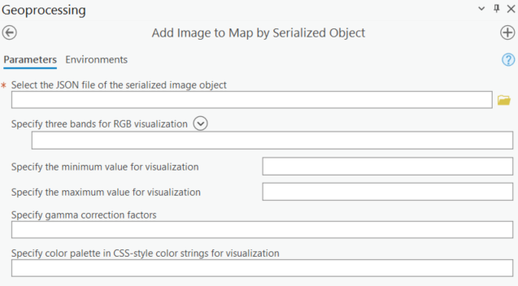
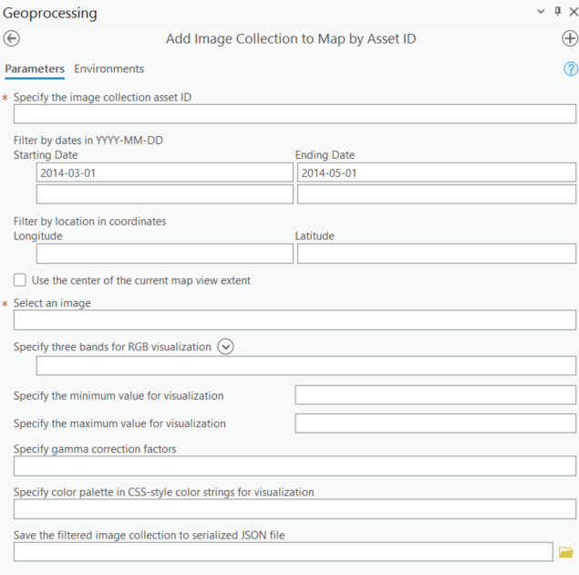
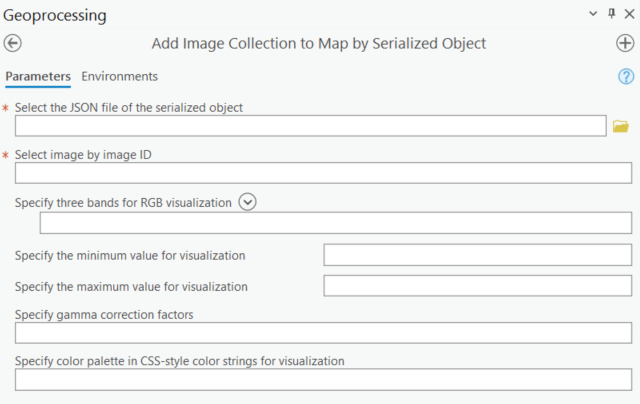
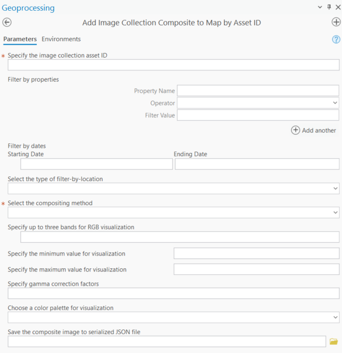

# ArcGIS Earth Engine Toolbox (GEE Connector) User Guide: Data Exploration Tools

These tools allow you to visualize Google Earth Engine feature collections, images and images collections from the [Earth Engine data catalog](https://developers.google.com/earth-engine/datasets), or Earth Engine assets within your Google Cloud Project. If you are looking to download data or run analytics, please see the Data Management and Data Processing toolboxes.

## Data Exploration Tools

### Add Feature Collection to Map by Asset ID

This script adds the Earth Engine Feature Collection dataset to ArcGIS Pro as a base map by its asset ID and customizes the visualization parameters. **To avoid slow response, the feature collection size is limited to 100,000 elements.**

Please note that the dataset is added as a Tiled Map Service Layer, which cannot be edited directly. The user will need to download the dataset for analysis in ArcGIS Pro. To browse all datasets, please visit this [link](https://developers.google.com/earth-engine/datasets/catalog).

#### Parameters

 1. Asset ID
 2. Filter by dataset properties
 3. Filter by dates
 4. Choose filter-by-location type: point or area
 5. Color for visualization
 6. Save the filtered dataset to serialized JSON file

> [!NOTE]
> The serialized JSON file contains only the filtered Earth Engine object and does not include any visualization parameters.

Here is the video guide for adding feature collection to map by asset ID:

  

### Add Feature Collection to Map by Serialized Object

This script adds the Earth Engine Feature Collection dataset to ArcGIS Pro as a base map by its serialized JSON object and customizes the visualization parameters. The serialized JSON object is the string representation of the dataset. The user can save the serialized Earth Engine object (Image, Image Collection, Feature, Feature Collection, List, Geometry, etc. ) to JSON file. This is helpful when the user filters the dataset and saves the modified dataset for future access.

**To avoid slow response, the feature collection size is limited to 100,000 elements. If the feature collection size is larger than 100,000 elements after filtering, the script will only display the first 100,000 elements.**

Please note that the dataset is added as a Tiled Map Service Layer, which cannot be edited. The user will need to download the dataset for analysis in ArcGIS Pro. To browse all datasets, please visit this [link](https://developers.google.com/earth-engine/datasets/catalog).

#### Parameters

1. Serialized JSON file
2. Color for visualization

Here is the video guide for adding feature collection to map by serialized object:

  

### Add Image to Map by Asset ID

This script adds the Earth Engine Image dataset to ArcGIS Pro as a base map by its asset ID and customizes the visualization parameters. Please note that the dataset is added as a Tiled Map Service Layer, which cannot be edited. The user will need to download the dataset for analysis in ArcGIS Pro. To browse all datasets, please visit this [link](https://developers.google.com/earth-engine/datasets/catalog).

#### Parameters

 1. Asset ID
 2. Select bands for visualization (up to 3)
 3. Minimum value for visualization (value to map to 0, up to 3 comma-seperated numbers)
 4. Maximum value for visualization (value to map to 255, up to 3 comma-seperated numbers)
 5. Gamma correction factors (value to multiply each pixel value, up to 3 comma-seperated numbers)
 6. Color palette in CSS-style (single-band images only, comma-separated list of hex strings)
 7. Save the filtered dataset to serialized JSON file

Here is the video guide for adding image to map by asset ID:

  

### Add Image to Map by Serialized Object

This script adds the Earth Engine Image dataset to ArcGIS Pro as a base map by its serialized JSON object and customizes the visualization parameters. Please note that the dataset is added as a Tiled Map Service Layer, which cannot be edited. The user will need to download the dataset for analysis in ArcGIS Pro. To browse all datasets, please visit this [link](https://developers.google.com/earth-engine/datasets/catalog).

The user can save the serialized Earth Engine object (Image, Image Collection, Feature, Feature Collection, List, Geometry, etc.) to JSON file, which is the string representation of the dataset. This is helpful when the user filters the dataset and saves the modified dataset for future access.

#### Parameters

 1. Serialized JSON file
 2. Select bands for visualization (up to 3)
 3. Minimum value for visualization (value to map to 0, up to 3 comma-seperated numbers)
 4. Maximum value for visualization (value to map to 255, up to 3 comma-seperated numbers)
 5. Gamma correction factors (value to multiply each pixel value, up to 3 comma-seperated numbers)
 6. Color palette in CSS-style (single-band images only, comma-separated list of hex strings)

Here is the video guide for adding image to map by serialized object:

  

### Add Image Collection to Map by Asset ID

This script adds the Earth Engine Image Collection dataset to ArcGIS Pro as a base map by its asset ID and customizes the visualization parameters. **The user can only add one image to ArcGIS Pro per run.** Please note that the dataset is added as a Tiled Map Service Layer, which cannot be edited directly. The user will need to download the dataset for analysis in ArcGIS Pro. To browse all datasets, please visit this [link](https://developers.google.com/earth-engine/datasets/catalog).

#### Parameters

 1. Asset ID
 2. Filter by dates
 3. Filter by point geometry in lat/lon coordinates
 4. Filter by the centroid of the current map view
 5. Select image from the filtered list
 6. Select bands for visualization (up to 3)
 7. Minimum value for visualization (value to map to 0, up to 3 comma-seperated numbers)
 8. Maximum value for visualization (value to map to 255, up to 3 comma-seperated numbers)
 9. Gamma correction factors (value to multiply each pixel value, up to 3 comma-seperated numbers)
 10. Color palette in CSS-style (single-band images only, comma-separated list of hex strings)
 11. Save the filtered dataset to serialized JSON file

Here is the video guide for adding image collection to map by asset ID:

  

### Add Image Collection to Map by Serialized Object

This script adds the Earth Engine Image Collection dataset to ArcGIS Pro as a base map by its serialized JSON object and customizes the visualization parameters. **The user can only add one image to ArcGIS Pro per run.** Please note that the dataset is added as a Tiled Map Service Layer, which cannot be edited. The user will need to download the dataset for analysis in ArcGIS Pro. To browse all datasets, please visit this [link](https://developers.google.com/earth-engine/datasets/catalog).

The user can save the serialized Earth Engine object (Image, Image Collection, Feature, Feature Collection, List, Geometry, etc.) to JSON file, which is the string representation of the dataset. This is helpful when the user filters the dataset and saves the modified dataset for future access.

#### Parameters

 1. Serialized JSON file
 2. Select image from the filtered list
 3. Select bands for visualization (up to 3)
 4. Minimum value for visualization (value to map to 0, up to 3 comma-seperated numbers)
 5. Maximum value for visualization (value to map to 255, up to 3 comma-seperated numbers)
 6. Gamma correction factors (value to multiply each pixel value, up to 3 comma-seperated numbers)
 7. Color palette in CSS-style (single-band images only, comma-separated list of hex strings)

Here is the video guide for adding image collection to map by serialized object:

  

### Add Image Collection Composite to Map by Asset ID

This script adds the Earth Engine Image Collection composite image to ArcGIS Pro as a base map by its asset ID and customizes the visualization parameters. **Please note that running this script can be computationally intensive if the filtered image collection contains a large number of images. It is recommended to apply additional filters to reduce the dataset size.** Please note that the dataset is added as a Tiled Map Service Layer, which cannot be edited directly. The user will need to download the dataset for analysis in ArcGIS Pro. To browse all datasets, please visit this [link](https://developers.google.com/earth-engine/datasets/catalog).

#### Parameters

 1. Asset ID
 2. Filter by dataset properties
 3. Filter by dates
 4. Choose filter-by-location type: point or area
 5. Select the compositing method
 6. Specify the percentile value (only available when the compositing method is "Percentile")
 7. Select bands for visualization (up to 3)
 8. Minimum value for visualization (value to map to 0, up to 3 comma-seperated numbers)
 9. Maximum value for visualization (value to map to 255, up to 3 comma-seperated numbers)
 10. Gamma correction factors (value to multiply each pixel value, up to 3 comma-seperated numbers)
 11. Choose a color palette for visualization (single-band images only)
 12. Save the composite image to serialized JSON file
