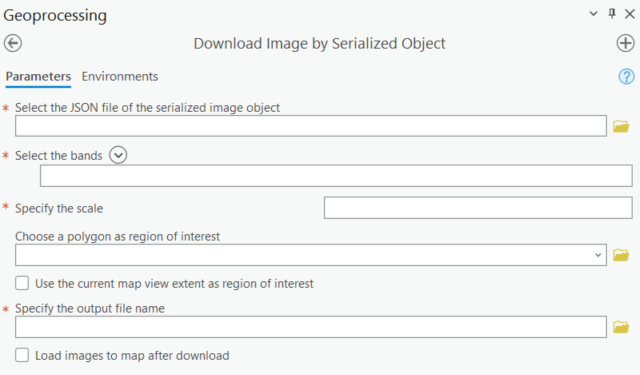
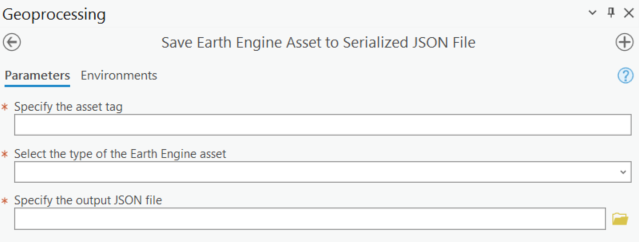
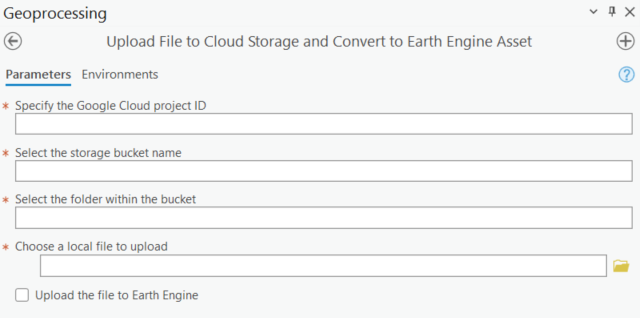

# ArcGIS Earth Engine Toolbox (GEE Connector) User Guide: Data Management Tools

These tools allow you to download Google Earth Engine feature collections, images and images collections from the [Earth Engine data catalog](https://developers.google.com/earth-engine/datasets), or Earth Engine assets within your Google Cloud Project. This toolbox also supports conversion of Google Cloud Storage files to an Earth Engine asset, or uploading files to Google Cloud Storage.

## Data Management Tools

### Convert Cloud Storage File to Earth Engine Asset

> [!NOTE]
> This script is only available for users who have installed Google Cloud SDK.

This script converts file(s) in Google Cloud Storage to Earth Engine asset. It is used to share dataset on the Earth Engine platform. The file(s) will be assigned with a user-specified asset ID.

There are two options to locate the target files:

1. If you know the gsutil URI of the target file, just specify the project ID and paste the URI to the file input. If you are dealing with a large bucket with lots of folders and files, it is recommended to use file URI directly. Otherwise, it will take time to locate the file.
2. If not, specify the project ID and select the bucket, folder and target file one by one.

You can convert the file(s) to the following types of Earth Engine assets:

1. Image, when you select one file in `.tif` format
2. Image collection, when you select multiple files in `.tif` format
3. Feature collection, when you select one file in `.shp`, `.csv`, `.zip` or `.tfrecord` format. **Each `.zip` file must contain only one shape file with its accessory files.**
4. Feature collections, when you select multiple files in `.shp`, `.csv`, `.zip` or `.tfrecord` format. Each file will be converted to a feature collection, respectively.

#### Parameters

1. Google Cloud project ID
2. Select the bucket (skip if you know the file gsutil URI)
3. Select the folder in the bucket (skip if you know the file gsutil URI)
4. Select file(s) in the folder or specify gsutil URI
5. Choose asset type (`image` or `table`)

6. Specify the asset ID

Here is the video guide for converting cloud storage file to Earth Engine asset:

  

### Download Feature Collection by Asset ID

This script downloads the Earth Engine feature collection dataset to ArcGIS Pro feature class by its asset ID. The geometry types of the feature collection can be converted to the ArcGIS Pro geometry types: point, multipoint, polyline, polygon. Since ArcGIS Pro feature class does not allow multiple geometry types in the same file, the different geometry types will be saved into separate feature class files.

#### Parameters

1. Asset ID
2. Filter by dataset properties
3. Filter by dates
4. Select the type of bounds to filter by
5. Specify point geometry in lat/lon coordinates if selected above
6. Specify the polygon feature as region of interest if selected above
7. Select the geometry type to download
8. Specify the output file name
9. Check the box to load feature class to map after download

Here is the video guide for downloading feature collection by asset ID:

  

### Download Feature Collection by Serialized Object

This script downloads the Earth Engine feature collection dataset to ArcGIS Pro feature class by its serialized JSON object. The user can save the serialized Google Earth Engine object (Image, Image Collection, Feature, Feature Collection, List, Geometry, etc. ) to JSON file. This is very helpful when the user filters the dataset and saves the modified dataset for future use.

The geometry types of the feature collection can be converted to the ArcGIS Pro geometry types: point, multipoint, polyline, polygon. Since ArcGIS Pro feature class does not allow multiple geometry types in the same file, the different geometry types will be saved into separate feature class files.

#### Parameters

1. Serialized JSON file
2. Select the geometry type to download
3. Specify the output file name
4. Check the box to load feature class to map after download

Here is the video guide for downloading feature collection by serialized object:

  

### Download Image by Asset ID

This script downloads the Earth Engine image dataset to GeoTIFF by its asset ID. It converts Earth Engine image object to xarray dataset using `xee` and writes to local GeoTIFF file using `rasterio`. Theoretically, there is no file size limitation compared to other functions such as `ee.Image.getDownloadURL()` and `ee.data.getPixels()`. Larger files will take longer to download.

#### Parameters

1. Asset ID
2. Select bands to download
3. Specify the scale in meters (image resolution)
4. Use a polygon feature as region of interest
5. Use the extent of the current map view as region of interest
6. Specify the output GeoTIFF name
7. Check the box to load image to map after download

Here is the video guide for downloading image by asset ID:

  

### Download Image by Serialized Object

This script downloads the Earth Engine image dataset to GeoTIFF by its serialized JSON object. It converts Earth Engine image object to xarray dataset using `xee` and writes to local GeoTIFF file using `rasterio`. Theoretically, there is no file size limitation compared to other functions such as `ee.Image.getDownloadURL()` and `ee.data.getPixels()`. Larger files will take longer to download.

#### Parameters

1. Serialized JSON file
2. Select bands to download
3. Specify the scale in meters (image resolution)
4. Use a polygon feature as region of interest
5. Use the extent of the current map view as region of interest
6. Specify the output GeoTIFF name
7. Check the box to load image to map after download

Here is the video guide for downloading image by serialized object:

  

### Download Image Collection by Asset ID

This script downloads the Earth Engine image collection dataset to GeoTIFF by its asset ID. It converts Earth Engine image collection object to xarray dataset using `xee` and writes to local GeoTIFF file using `rasterio`. Theoretically, there is no file size limitation compared to other functions such as `ee.Image.getDownloadURL()` and `ee.data.getPixels()`. Larger files will take longer to download.

#### Parameters

 1. Asset ID
 2. Filter by dates
 3. Filter by point geometry in lat/lon coordinates
 4. Filter by the centroid of the current map view
 5. Select images to download
 6. Select bands to download
 7. Specify the scale in meters (image resolution)
 8. Use a polygon feature as region of interest
 9. Use the extent of the current map view as region of interest
 10. Specify the output folder
 11. Check the box to load images to map after download

Here is the video guide for downloading image collection by asset ID:

  

### Download Image Collection by Asset ID at Multiple Regions

This script downloads the Earth Engine image collection dataset to GeoTIFF by its asset ID at multiple regions. Each object in the input polygon features is considered as a region of interest. Images will be clipped to each region of interest.

#### Parameters

1. Asset ID
2. Filter by dates
3. Use a polygon feature as region of interest
4. Select the type of bounds to filter by
5. Specify the maximum number of images to download per region
6. Select the bands to download
7. Specify the scale in meters (image resolution)
8. Specify the output folder
9. Check the box to load images to map after download

Here is the video guide for downloading image collection by asset ID at multiple regions:

  

### Download Image Collection by Serialized Object

This script downloads the Earth Engine image collection dataset to GeoTIFF by its serialized JSON object. It converts Earth Engine image collection object to xarray dataset using `xee` and writes to local GeoTIFF file using `rasterio`. Theoretically, there is no file size limitation compared to other functions such as `ee.Image.getDownloadURL()` and `ee.data.getPixels()`. Larger files will take longer to download.

#### Parameters

 1. Serialized JSON file
 2. Select images to download
 3. Select bands to download
 4. Specify the scale in meters (image resolution)
 5. Use a polygon feature as region of interest
 6. Use the extent of the current map view as region of interest
 7. Specify the output GeoTIFF name
 8. Check the box to load images to map after download

Here is the video guide for downloading image collection by serialized object:

  

### Save Earth Engine Asset to Serialized JSON File

This script exports Earth Engine dataset from an asset ID to a serialized JSON file, allowing for quick access in the future without needing to recall the asset ID.

#### Parameters

 1. Asset ID
 2. Asset type (`Feature Collection`, `Image` or `Image Collection`)
 3. Specify output JSON file name

Here is the video guide for saving Earth Engine asset to serialized JSON file:

  

### Upload File to Cloud Storage and Convert to Earth Engine Asset

> [!NOTE]
> This script is only available for users who have installed Google Cloud SDK.

This script uploads file(s) from local storage to Google Cloud Storage and converts file(s) to Earth Engine asset. It is used to share dataset on Google Cloud and the Earth Engine platform. The file(s) will be assigned with a user-specified asset ID.

There are two options to locate the target files:

1. If you know the gsutil URI of the target file, just specify the project ID and paste the URI to the file input. If you are dealing with a large bucket with lots of folders and files, it is recommended to use file URI directly. Otherwise, it will take time to locate the file.
2. If not, specify the project ID and select the bucket, folder and target file one by one.

You can convert the file(s) to the following types of Earth Engine assets:

1. Image, when you select one file in `.tif` format
2. Image collection, when you select multiple files in `.tif` format
3. Feature collection, when you select one file in `.shp`, `.csv`, `.zip` or `.tfrecord` format. **Each `.zip` file must contain only one shape file with its accessory files.**
4. Feature collections, when you select multiple files in `.shp`, `.csv`, `.zip` or `.tfrecord` format. Each file will be converted to a feature collection, respectively.

#### Parameters

1. Google Cloud project ID
2. Select the bucket
3. Select the folder in the bucket
4. Select file(s) from local storage
5. Check the box to upload to Earth Engine (Optional)
6. Choose asset type (`image` or `table`)

7. Specify the asset ID

Here is the video guide for uploading file to cloud storage and converting to Earth Engine asset:

  

