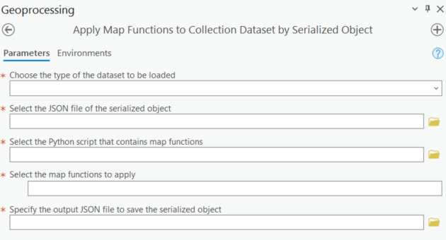
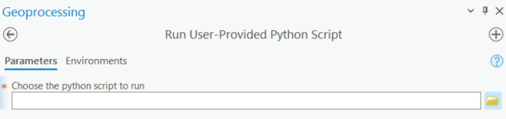

# ArcGIS Earth Engine Toolbox User Guide: Data Processing Tools
These tools allow applying filters and map functions to collection datasets, apply reducers and run Python scripts.

## Data Processing Tools

### Apply Filters to Collection Dataset by Asset ID

This script applies filters to feature collection or image collection by asset ID, and saves the filtered dataset to serialized JSON object for future use. 

To browser all available earth engine filters, please visit [this link](https://developers.google.com/earth-engine/apidocs/ee-filter). 

For a quick guide on filtering feature collection, please visit [this link](https://developers.google.com/earth-engine/guides/feature_collection_filtering).

For a quick guide on filtering image collection, please visit [this link](https://developers.google.com/earth-engine/guides/ic_filtering).  


#### Parameters

1. Choose the type of dataset to filter
2. Asset ID
3. Specify the filters and the corresponding arguments
4. Specify the output JSON file name


Here is the video guide for applying filters to collection dataset by asset ID:

<div align="center">
  <a href="https://www.youtube.com/watch?v=KXi2LGbp--U" target="_blank">
    
  </a>
</div>


### Apply Filters to Collection Dataset by Serialized Object

This script applies filters to feature collection or image collection by serialized JSON object, and saves the filtered dataset to a new serialized JSON object for future use. It is useful when you want to apply filters to the existing JSON object. 

To browser all available earth engine filters, please visit [this link](https://developers.google.com/earth-engine/apidocs/ee-filter). 

For a quick guide on filtering feature collection, please visit [this link](https://developers.google.com/earth-engine/guides/feature_collection_filtering).

For a quick guide on filtering image collection, please visit [this link](https://developers.google.com/earth-engine/guides/ic_filtering). 


#### Parameters

1. Serialized JSON file
2. Specify the filters and the corresponding arguments
3. Specify the output JSON file name


Here is the video guide for applying filters to collection dataset by serialized object:

<div align="center">
  <a href="https://www.youtube.com/watch?v=6SZdwaiiM-M" target="_blank">
    
  </a>
</div>


### Apply Map Functions to Collection Dataset by Asset ID

This script applies user-defined map functions to the feature collection or image collection dataset by asset ID and saves the processed dataset to a serialized JSON object for future use.

For a quick guide on mapping over image collection dataset, please visit [this link](https://developers.google.com/earth-engine/guides/ic_mapping).

For a quick guide on mapping over feature collection dataset, please visit [this link](https://developers.google.com/earth-engine/guides/feature_collection_mapping).


#### Parameters

1. Choose the type of dataset to process
2. Asset ID
3. Specify the python script that contains the map functions
4. Select the map functions to apply
5. Specify the output JSON file name


>[!NOTE] 
> The python script that contains the map functions must be saved in the same folder as the GEE Connector Python Toolbox.

Here is the video guide for applying map functions to collection dataset by asset ID:

<div align="center">
  <a href="https://www.youtube.com/watch?v=qKPIULsXd-s" target="_blank">
    
  </a>
</div>


### Apply Map Functions to Collection Dataset by Serialized Object

This script applies user-define map functions to the feature collection or image collection dataset by the serialized JSON object and saves the processed dataset to a new serialized JSON object for future use. It is useful when you want to apply map functions to the existing JSON object. 

For a quick guide on mapping over image collection dataset, please visit [this link](https://developers.google.com/earth-engine/guides/ic_mapping).

For a quick guide on mapping over feature collection dataset, please visit [this link](https://developers.google.com/earth-engine/guides/feature_collection_mapping).



#### Parameters

1. Choose the type of dataset to process
2. Serialized JSON file
3. Specify the python script that contains the map functions
4. Select the map functions to apply
5. Specify the output JSON file name


>[!NOTE] 
> The python script that contains the map functions must be saved in the same folder as the GEE Connector Python Toolbox.

Here is the video guide for applying map functions to collection dataset by serialized object:

<div align="center">
  <a href="https://www.youtube.com/watch?v=ijjgf6c0EjU" target="_blank">
    
  </a>
</div>


### Apply Reducers to Earth Engine Dataset by Asset ID

This script applies reducers to the feature collection, image or image collection dataset by asset ID and saves the processed dataset to a serialized JSON object for future use.

To browser all available earth engine filters, please visit [this link](https://developers.google.com/earth-engine/apidocs/ee-reducer-allnonzero).

For reducer overview, please visit [this link](https://developers.google.com/earth-engine/guides/reducers_intro).


#### Parameters

1. Choose the type of dataset to process
2. Choose the reduction method
3. Specify the arguments for the reduction method
4. Asset ID
5. Specify the filters and the corresponding arguments
6. Specify the reducers and the corresponding arguments
7. Specify the output JSON file name


### Apply Reducers to Earth Engine Dataset by Serialized Object

This script applies reducers to the feature collection, image or image collection dataset by serialized JSON object and saves the processed dataset to a new serialized JSON object for future use. It is useful when you want to apply reducers to the existing JSON object.

To browser all available earth engine filters, please visit [this link](https://developers.google.com/earth-engine/apidocs/ee-reducer-allnonzero).

For reducer overview, please visit [this link](https://developers.google.com/earth-engine/guides/reducers_intro).


#### Parameters

1. Choose the type of dataset to process
2. Choose the reduction method
3. Specify the arguments for the reduction method
4. Serialized JSON file
5. Specify the reducers and the corresponding arguments
6. Specify the output JSON file name


### Run User-Provided Python Script

This script enables users to execute customized Python scripts within ArcPro. To ensure your script runs successfully, follow these tips:

1.	Include the following line at the beginning of your script to import the Earth Engine API 
```
import ee
```
2.	Unlike the ArcPro environment, the Earth Engine API must be initialized separately. Add the following line to your script, replacing QUOTA_PROJECT_ID with your project ID
```
ee.Initialize(project='QUOTA_PROJECT_ID')
```
3.	Set workload tag if needed, add the following line to your script, replacing WORKLOAD_TAG with your workload tag such as "arcgis-ee-connector"  
```
ee.data.setWorkloadTag(WORKLOAD_TAG)
``` 
4.	To prevent the script window from closing immediately after execution, include this line at the end of your code:
```
input("Press Enter to exit...")
```



#### Parameters

1. Specify the python script
