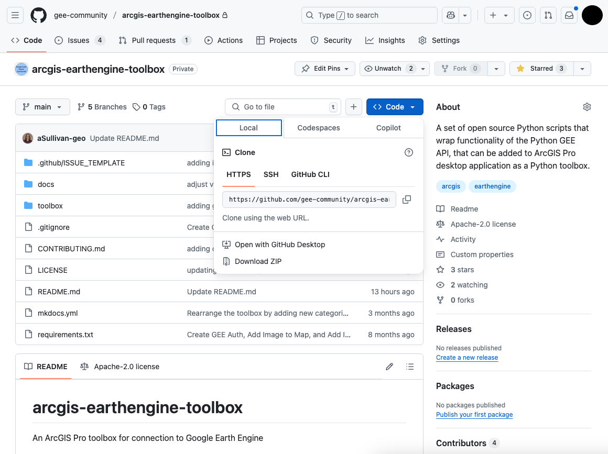
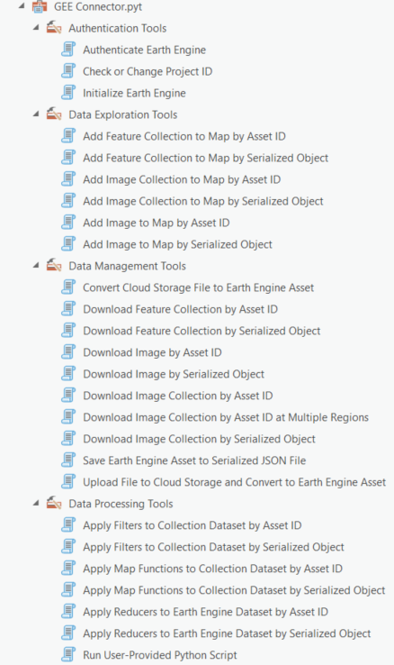
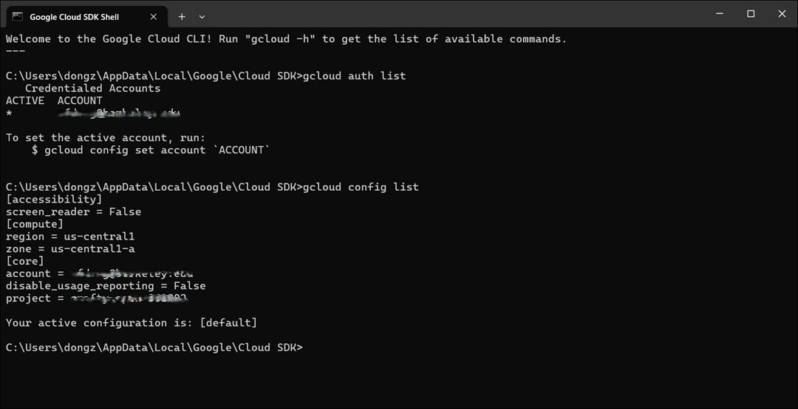

# Installation

## Conda Environment Setup For Earth Engine API  

Before starting the installation, ensure that you have the necessary account permissions to create a conda environment and install the required packages. **If your ArcPro was installed by an administrator, you will need administrator-level permissions to complete the installation.**  

For ArcPro version `3.x`, follow the steps below to set up the conda environment. If you have ArcPro version lower than `3.0`, it is suggested that you upgrade it to `3.x`. You can login to your ESRI account, and download the specific ArcPro version from the **Downloads** -> **All Products and Versions** -> **All Versions**.  

### Step 1 - Run ArcGIS Python Command Prompt 

To do this in your Windows computer, go to **Start Menu** -> **All Apps** -> **ArcGIS folder** -> **Python Command Prompt**, click to run. To run the Python Command Prompt as administrator, right-click on the Python Command Prompt, and select **Run as administrator**.


### Step 2 - Set up the Conda Environment

Once you run the Python Command Prompt,

1. List all available conda environments using the following command. The default ArcPro package should be `arcgispro-py3`. 

        conda env list

2. You cannot modify the default package `arcgispro-py3`. Instead, clone it to create a new conda environment `gee`. Please make sure to use a new name for the conda environment. Creating conda environment with the existing name `gee` will overwrite the existing conda environment. 

        conda create --name gee --clone arcgispro-py3

3. (**Optional**) Initialize conda for the proper shell. It is required to run this command for the first time of using `conda activate`.    

        conda init cmd.exe 

    **After running the command, please make sure to restart the Python Command Prompt.** To do this, close the current Python Command Prompt window and open a new one.  

4. Activate the new conda environment `gee`. 

        conda activate gee 

5. (**Optional**) Disable the SSL verification. It is suggested to run this command for the first time of using `conda install`.

        conda config --set ssl_verify false

6. Install `earthengine-api` and `xee` from `conda-forge` channel. Please note that these two packages are unavailable in `esri` channel. It is recommended to use `conda install` instead of `mamba install`, because `mamba install` may not work properly with `earthengine-api` and `xee`. 

        conda install earthengine-api xee -c conda-forge

7. Install specific version of `rasterio` from `esri` channel. The default installation version of `rasterio=1.3.10` may be incompatible with ArcPro pre-installed `gdal`.

        conda install rasterio=1.3.9 -c esri
    
8. Activate package `gee` within ArcPro

        proswap gee 
    

After running the above commands, close Python Command Prompt, and start ArcPro. The default conda environment becomes `gee`. To check if the packages have been successfully installed, click **Analysis** -> **Python** -> **Python Window**. Run the following commands. 

    import ee
    import xee
    import rasterio

The `earthengine-api` is then ready for authentication and initialization.

Here is the video guide for the Conda environment setup:

<a href="https://www.youtube.com/watch?v=wuC4rKjKZEQ" target="_blank">
  
</a>


## Download ArcGEE Connector Toolbox

The ArcGEE Connector Toolbox can be obtained through the following steps:



1. Download the repository from this [link](https://github.com/di-private/redlands-desktop-engine/tree/woolpert_dev) using either method:
   - Clone the repository using git: `git clone https://github.com/di-private/redlands-desktop-engine.git`
   - Or download as ZIP file and extract it to your desired location

   You can download the repository folder to your ArcPro project folder such as `C:\Users\<username>\Documents\ArcGIS\Projects\<project_name>\ArcGEE Connector Toolbox`. Meanwhile, you can also download the repository folder to any other location and connect it to ArcPro. 

2. Add the toolbox to ArcPro:
   - Open ArcPro
   - In the Catalog pane, right-click on "Toolboxes"    
   - Select "Add Toolbox"
   - Navigate to and select the toolbox in the downloaded repository folder

3. The toolbox will appear in the Toolbox dropdown menu.




## Google Cloud SDK

Google Cloud SDK is required to fully utilize the ArcGEE Connector Toolbox. Specifically, it is used to upload local data to Google Cloud Storage and convert the data to Earth Engine Image objects. 

To install the Google Cloud SDK, admin permissions are often required, especially on systems where the SDK needs to modify system files or be installed for all users. It's also possible to install the SDK without admin rights if you install it in a user-specific directory. 

Admin rights are typically only required during installation. Most gcloud commands and operations can be performed without admin rights, provided the user has the correct permissions within Google Cloud.

When Google Cloud SDK is installed, the Google Cloud default credentials may affect Google Earth Engine authentication through ArcGEE Connector Toolbox. Therefore, it is recommended to modify Google Cloud default credentials to be consistent with the target Google project for Earth Engine. To achieve this, follow the steps below.

### Finding Your Google Cloud Project ID
Before proceeding, you'll need your Google Cloud Project ID. To find it:
1. Go to the [Google Cloud Console](https://console.cloud.google.com)
2. Click on the project dropdown at the top of the page
3. Your Project ID is listed in the projects table
   - Note: The Project ID is different from the Project Name
   - It typically looks like: `my-project-123456` or `project-id-123456`

### Configuring Google Cloud SDK

The Google Cloud SDK shell (commonly referred to as the gcloud command-line interface) operates in a terminal or command prompt environment and has a standard text-based interface. It doesn't have a graphical user interface but relies on commands and text outputs.



1. In Windows OS, search for "Google Cloud SDK Shell", click to open. To run the Google Cloud SDK Shell as administrator, right-click on the Google Cloud SDK Shell, and select **Run as administrator**. 

   **For the first time setup, skip Step 2 and Step 3, go to Step 4.**

2. Check the active Google account using:
   ```
   gcloud auth list
   ```
   Make sure the account aligns with the target Google project for Earth Engine. If you need to switch to another account, run:
   ```
   gcloud auth login
   ```
   A browser window will open asking you to choose the target Google account for Earth Engine.

3. Check the active Google project using:
   ```
   gcloud config list
   ```
   Verify that the project ID matches your target Google project for Earth Engine. To switch to a different project, run:
   ```
   gcloud config set project YOUR_PROJECT_ID
   ```
   Replace `YOUR_PROJECT_ID` with the Project ID you found in the Google Cloud Console.

4. For the first time setup, authenticate to create the `application_default_credentials.json` file using:
   ```
   gcloud auth application-default login
   ```
   A browser window will pop up asking you to choose the target Google account and project.
   
   For the existing setup, update the `application_default_credentials.json` file using:
   ```
   gcloud auth application-default set-quota-project QUOTA_PROJECT_ID
   ```
   Replace `QUOTA_PROJECT_ID` with the Project ID you found in the Google Cloud Console.

   **Note:** The `application_default_credentials.json` file is usually located in the `C:\Users\<username>\AppData\Roaming\gcloud` directory.

   After this, when you run `ee.Initialize()`, it will automatically use the default project specified in the `application_default_credentials.json` file.
