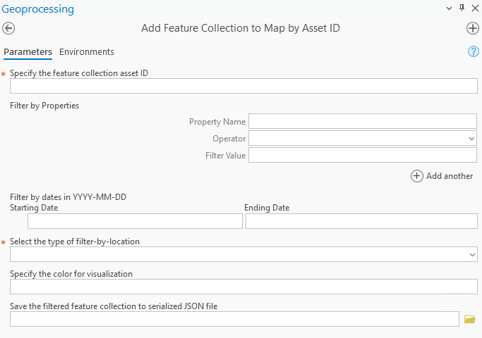
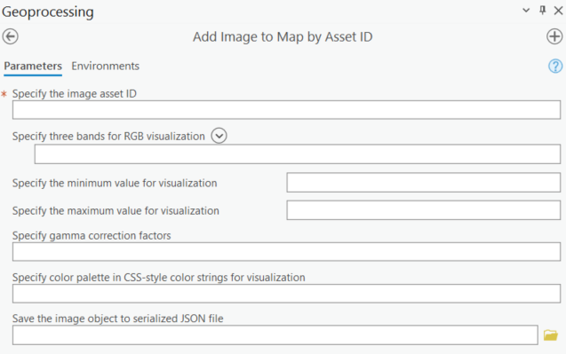
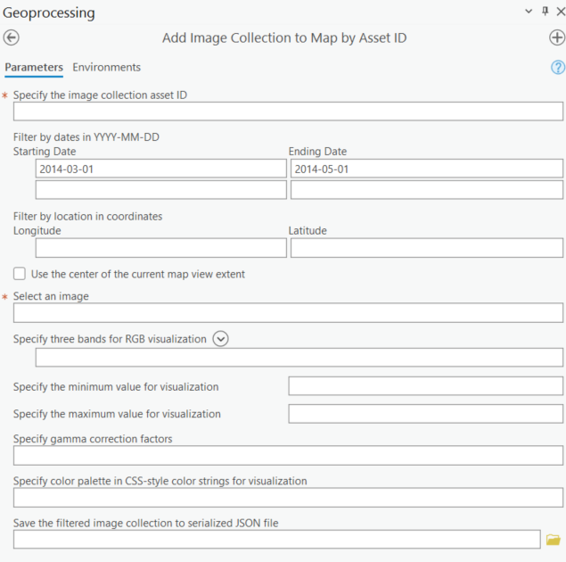

# ArcGEE Connector User Guide

## Introduction

This user guide provides instructions for using the ArcGEE Connector, a Python toolbox that allows users to interact with Google Earth Engine (GEE) from ArcGIS Pro. The toolbox provides a set of tools for managing Earth Engine assets, downloading and uploading data, and processing data using Earth Engine's API.

## Prerequisites

Before using the ArcGEE Connector, ensure you have the following:

1. ArcGIS Pro installed on your computer.
2. Google Earth Engine API enabled for your Google Cloud project.
3. Google Cloud SDK installed on your computer.

## Key Concepts Overview

### Google Earth Engine

Google Earth Engine (GEE) is a cloud-based platform that provides access to a wide range of satellite imagery and geospatial datasets. It allows users to perform complex geospatial analysis and visualization tasks using a wide range of Earth observation data.

### Google Cloud Project

A Google Cloud project is a container for resources and services in Google Cloud. Each project has a unique ID and is associated with a billing account.

To find your project ID, go to the [Google Cloud Console](https://console.cloud.google.com/), click on the project dropdown menu in the top left corner, and select "Project info". The project ID is displayed in the "Project ID" field.

### Workload Tag

Workload tags are labels for monitoring specific computations within Earth Engine. The user can monitor and track tagged computations in the Metrics Explorer using the Earth Engine Cloud Project > Project > Used EECUs metric, and grouping or filtering by workload_tag. Refer to [this link](https://developers.google.com/earth-engine/guides/monitoring_usage) for more information.

**Workload tag must be 1 - 63 characters, beginning and ending with an alphanumeric character ([a-z0-9A-Z]) with dashes (-), underscores (_), dots (.), and alpha numerics between, or an empty string to reset the default back to none.**


### Google Cloud SDK

The Google Cloud SDK (Software Development Kit) is a collection of tools and libraries designed to interact with Google Cloud services. It provides the core tools necessary for managing resources and services on Google Cloud.

Key components include:

- gcloud CLI: A command-line tool to manage Google Cloud resources (e.g., deploying applications, managing Kubernetes clusters, configuring services, etc.).
- gsutil: A command-line tool for working with Google Cloud Storage (e.g., uploading, downloading, and managing storage buckets and objects).
- bq: A command-line tool for interacting with BigQuery.
- Libraries and APIs: Programming tools to help developers integrate with Google Cloud.

### Google Cloud SDK Shell

The Google Cloud SDK Shell (specific to Windows) is a pre-configured command-line shell that comes with the Google Cloud SDK installation for Windows users. It provides:

- A command-line environment with all the tools from the Google Cloud SDK ready to use.
- A pre-configured path for Google Cloud SDK binaries, so users don’t have to configure environment variables manually.
- Windows-specific convenience: It simplifies setup and usage, especially for users who are less comfortable with configuring standard shells like PowerShell or Command Prompt.

### ArcGIS Python Toolbox

An ArcGIS Python Toolbox (.pyt) is a specialized type of toolbox in the ArcGIS platform, created using Python. It allows users to develop and integrate geoprocessing tools and workflows directly into ArcGIS using Python scripting. 

An ArcGIS Python Toolbox (created as a .pyt file) does not inherently include a custom-designed graphical user interface (GUI). Instead, its GUI is dynamically generated by ArcGIS Pro or ArcMap's **Geoprocessing Pane** or **Toolbox Window**. When a Python toolbox is added to ArcGIS, its tools appear as menu items, and selecting a tool opens a standard ArcGIS geoprocessing dialog box where users can interact with the tool's parameters.

The GUI for tools in a Python toolbox includes:

1. Tool Name and Description:

The top of the dialog box displays the tool's name and an optional description that the user can define in the Python script.

2. Parameter Input Fields and Description:

Input field types depend on the parameter data type, such as:
- Dropdowns for choices.
- File or layer pickers for datasets.
- Textboxes for string or numeric inputs.
- **Required parameters are marked with a red asterisk.**
- **Input parameters without a red asterisk are optional.**

Each parameter has a description that the user can define in the Python script.

3. Messages Section:

A section displays any messages generated during execution, such as progress updates, warnings, or errors. **The user can click "View Details" at the bottom of the script to view the full message during or after execution.**

4. Environment Settings:

Users can modify environment settings like processing extents, output coordinate systems, and cell sizes through an additional expandable menu. **Environment settings are unnecessary for the ArcGEE Connector.**

## Authentication Tools

### Authenticate Earth Engine

This script authenticates the use of Google Earth Engine with provided Google account. **The user only needs to run this script once on the same computer.** 


The project ID and workload tag are optional inputs here. If the user inputs the project ID, the script will also initialize the Earth Engine.  The user can define them in the "Initialize Earth Engine" script later. To use Earth Engine, you'll need access to a Cloud project that:

1.	has the Earth Engine API enabled, refer to [this link](https://developers.google.com/earth-engine/guides/access) for more information.
2.	is registered for commercial or noncommercial use. Earth Engine, Google's geospatial science platform in Google Cloud, is **available for paid commercial use and remains free for academic and research use.** Refer to [this link](https://code.earthengine.google.com/register) to register for commercial use or noncommercial use.
3.	grants you (or the user) the correct roles and permissions.


Please note that if you have installed Google Cloud SDK shell and set up the application default credentials, this script will authenticate Earth Engine using the quota project ID in the `application_default_credentials.json` usually located at `C:\Users\user_name\AppData\Roaming\gcloud`. If you don't have Google Cloud SDK shell, the script will authenticate through the web browser. 

#### Parameters
 1. Google Cloud project ID (Optional)
 2. Wrokload tag (Optional)


### Check or Change Project ID 

This script displays the current Google Cloud quota project ID and allows users to switch quota project ID and workload tag associated with Google Earth Engine if needed. 


Please note that if you have installed Google Cloud SDK shell, you cannot switch quota project ID using this script. Instead, open the Google Cloud SDK shell, copy and paste the following command `gcloud auth application-default set-quota-project QUOTA_PROJECT_ID`, replace the `QUOTA_PROJECT_ID` with your target project ID.

#### Parameters
 1. Current project ID (automatically displays)
 2. Current workload tag (automatically displays)
 3. New project ID (Optional)
 4. New workload tag (Optional)  

  
### Initialize Earth Engine 
The script initialize the use of Google Earth Engine with a project ID and workload tag. The user must assign a project ID to use Earth Engine. **The user will need to run this script every time they start the ArcPro.**  


#### Parameters 
 1. Google Cloud project ID 
 2. Workload tag (Optional)

## Data Exploration Tools 

### Add Feature Collection to Map by Asset ID

This script adds the Earth Engine Feature Collection dataset to ArcPro as a base map by its asset ID and customizes the visualization parameters. **To avoid slow response, the feature collection size is limited to 100,000 elements.**

Please note that the dataset is added as a Tiled Service Layer (TSL), which cannot be edited directly. The user will need to download the dataset for analysis in ArcPro. To browse all datasets, please visit this [link](https://developers.google.com/earth-engine/datasets/catalog).



#### Parameters 
 1. Asset ID
 2. Filter by dataset properties
 3. Filter by dates
 4. Filter by point gemoetry in lat/lon coordinates
 5. Filter by the centroid of the current map view
 6. Filter by the extent of the current map view 
 7. Color for visualization
 8. Save the filtered dataset to serialized JSON file


### Add Feature Collection to Map by Serialized Object 

This script adds the Earth Engine Feature Collection dataset to ArcPro as a base map by its serialized JSON object and customizes the visualization parameters. The serialized JSON object is the string representation of the dataset. The user can save the serialized Earth Engine object (Image, Image Collection, Feature, Feature Collection, List, Geometry, etc. ) to JSON file. This is helpful when the user filters the dataset and saves the modified dataset for future access. 

**To avoid slow response, the feature collection size is limited to 100,000 elements. If the feature collection size is larger than 100,000 elements after filtering, the script will only display the first 100,000 elements.**


Please note that the dataset is added as a Tiled Service Layer (TSL), which cannot be edited. The user will need to download the dataset for analysis in ArcPro. To browse all datasets, please visit this [link](https://developers.google.com/earth-engine/datasets/catalog).

#### Parameters
1. Serialized JSON file
2. Color for visualization

### Add Image to Map by Asset ID

This script adds the Earth Engine Image dataset to ArcPro as a base map by its asset ID and customizes the visualization parameters. Please note that the dataset is added as a Tiled Service Layer (TSL), which cannot be edited. The user will need to download the dataset for analysis in ArcPro. To browse all datasets, please visit this [link](https://developers.google.com/earth-engine/datasets/catalog).



#### Parameters 

 1. Asset ID
 2. Select bands for visualization (up to 3)
 3. Minimum value for visualization (value to map to 0, up to 3 comma-seperated numbers)
 4. Maximum value for visualization (value to map to 255, up to 3 comma-seperated numbers)
 5. Gamma correction factors (value to multiply each pixel value, up to 3 comma-seperated numbers)
 6. Color palette in CSS-style (single-band images only, comma-separated list of hex strings)
 7. Save the filtered dataset to serialized JSON file

### Add Image to Map by Serialized Object


This script adds the Earth Engine Image dataset to ArcPro as a base map by its serialized JSON object and customizes the visualization parameters. Please note that the dataset is added as a Tiled Service Layer (TSL), which cannot be edited. The user will need to download the dataset for analysis in ArcPro. To browse all datasets, please visit this [link](https://developers.google.com/earth-engine/datasets/catalog).

The user can save the serialized Earth Engine object (Image, Image Collection, Feature, Feature Collection, List, Geometry, etc.) to JSON file, which is the string representation of the dataset. This is helpful when the user filters the dataset and saves the modified dataset for future access. 

#### Parameters 

 1. Serialized JSON file 
 2. Select bands for visualization (up to 3)
 3. Minimum value for visualization (value to map to 0, up to 3 comma-seperated numbers)
 4. Maximum value for visualization (value to map to 255, up to 3 comma-seperated numbers)
 5. Gamma correction factors (value to multiply each pixel value, up to 3 comma-seperated numbers)
 6. Color palette in CSS-style (single-band images only, comma-separated list of hex strings)

### Add Image Collection to Map by Asset ID

This script adds the Earth Engine Image Collection dataset to ArcPro as a base map by its asset tag and customizes the visualization parameters. **The user can only add one image to ArcPro per run.** Please note that the dataset is added as a Tiled Service Layer (TSL), which cannot be edited directly. The user will need to download the dataset for analysis in ArcPro. To browse all datasets, please visit this [link](https://developers.google.com/earth-engine/datasets/catalog).



#### Parameters 

 1. Asset ID
 2. Filter by dates
 3. Filter by point gemoetry in lat/lon coordinates
 4. Filter by the centroid of the current map view
 5. Select image from the filtered list
 6. Select bands for visualization (up to 3)
 7. Minimum value for visualization (value to map to 0, up to 3 comma-seperated numbers)
 8. Maximum value for visualization (value to map to 255, up to 3 comma-seperated numbers)
 9. Gamma correction factors (value to multiply each pixel value, up to 3 comma-seperated numbers)
 10. Color palette in CSS-style (single-band images only, comma-separated list of hex strings)
 11. Save the filtered dataset to serialized JSON file

### Add Image Collection to Map by Serialized Object

This script adds the Earth Engine Image Collection dataset to ArcPro as a base map by its serialized JSON object and customizes the visualization parameters. **The user can only add one image to ArcPro per run.** Please note that the dataset is added as a Tiled Service Layer (TSL), which cannot be edited. The user will need to download the dataset for analysis in ArcPro. To browse all datasets, please visit this [link](https://developers.google.com/earth-engine/datasets/catalog).


The user can save the serialized Earth Engine object (Image, Image Collection, Feature, Feature Collection, List, Geometry, etc.) to JSON file, which is the string representation of the dataset. This is helpful when the user filters the dataset and saves the modified dataset for future access. 


#### Parameters 
 1. Serialized JSON file
 2. Select image from the filtered list
 3. Select bands for visualization (up to 3)
 4. Minimum value for visualization (value to map to 0, up to 3 comma-seperated numbers)
 5. Maximum value for visualization (value to map to 255, up to 3 comma-seperated numbers)
 6. Gamma correction factors (value to multiply each pixel value, up to 3 comma-seperated numbers)
 7. Color palette in CSS-style (single-band images only, comma-separated list of hex strings)


## Data Management Tools

### Convert Cloud Storage File to Earth Engine Asset

This script converts file(s) in Google Cloud Storage to Earth Engine asset. It is used to share dataset on the Earth Engine platform. The file(s) will be assigned with a user-specified asset tag. 


There are two options to locate the target files: 

1.	If you know the gsutil URI of the target file, just specify the project ID and paste the URI to the file input. If you are dealing with a large bucket with lots of folders and files, it is recommended to use file URI directly. Otherwise, it will take time to locate the file. 
2.	If not, specify the project ID and select the bucket, folder and target file one by one.

You can convert the file(s) to the following types of Earth Engine assets:

1.	Image, when you select one file in `.tif` format
2.	Image collection, when you select multiple files in `.tif` format
3.	Feature collection, when you select one file in `.shp`, `.csv`, `.zip` or `.tfrecord` format. **Each `.zip` file must contain only one shape file with its accessory files.**  
4.	Feature collections, when you select multiple files in `.shp`, `.csv`, `.zip` or `.tfrecord` format. Each file will be converted to a feature collection, respectively. 

#### Parameters 

1. Google Cloud project ID 
2. Select the bucket (skip if you know the file gsutil URI)
3. Select the folder in the bucket (skip if you know the file gsutil URI)
4. Select file(s) in the folder or specify gsutil URI
5. Choose asset type (`image` or `table`)
6. Specify the asset tag/ID


### Download Feature Collection by Asset ID


This script downloads the Earth Engine feature collection dataset to ArcPro feature class by its asset ID. The geometry types of the feature collection can be converted to the ArcPro geometry types: point, multipoint, polyline, polygon. Since ArcPro feature class does not allow multiple geometry types in the same file, the different geometry types will be saved into separate feature class files. 
 

#### Parameters

1. Asset ID
2. Filter by dataset properties
3. Filter by dates
4. Select the type of bounds to filter by
5. Specify point gemoetry in lat/lon coordinates if selected above
6. Specify the polygon feature as region of interest if selected above
7. Select the geometry type to download
8. Specify the output file name
9. Check the box to load feature class to map after download


### Download Feature Collection by Serialized Object

This script downloads the Earth Engine feature collection dataset to ArcPro feature class by its serialized JSON object. The user can save the serialized Google Earth Engine object (Image, Image Collection, Feature, Feature Collection, List, Geometry, etc. ) to JSON file. This is very helpful when the user filters the dataset and saves the modified dataset for future use. 

The geometry types of the feature collection can be converted to the ArcPro geometry types: point, multipoint, polyline, polygon. Since ArcPro feature class does not allow multiple geometry types in the same file, the different geometry types will be saved into separate feature class files. 


#### Parameters

1. Serialized JSON file
2. Select the geometry type to download
3. Specify the output file name
4. Check the box to load feature class to map after download

### Download Image by Asset ID


This script downloads the Earth Engine image dataset to GeoTIFF by its asset ID. It converts Earth Engine image object to xarray dataset using `xee` and writes to local GeoTIFF file using `rasterio`. Theoretically, there is no file size limitation compared to other functions such as `ee.Image.getDownloadURL()` and `ee.data.getPixels()`. Larger files will take longer to download.    

#### Parameters

1. Asset ID
2. Select bands to download
3. Specify the scale in meters (image resolution)
4. Use a polygon feature as region of interest
5. Use the extent of the current map view as region of interest
6. Specify the output GeoTIFF name
7. Check the box to load image to map after download


### Download Image by Serialized Object

This script downloads the Earth Engine image dataset to GeoTIFF by its serialized JSON object. It converts Earth Engine image object to xarray dataset using `xee` and writes to local GeoTIFF file using `rasterio`. Theoretically, there is no file size limitation compared to other functions such as `ee.Image.getDownloadURL()` and `ee.data.getPixels()`. Larger files will take longer to download. 


#### Parameters

1. Serialized JSON file
2. Select bands to download
3. Specify the scale in meters (image resolution)
4. Use a polygon feature as region of interest
5. Use the extent of the current map view as region of interest
6. Specify the output GeoTIFF name
7. Check the box to load image to map after download


### Download Image Collection by Asset ID

This script downloads the Earth Engine image collection dataset to GeoTIFF by its asset ID. It converts Earth Engine image collection object to xarray dataset using `xee` and writes to local GeoTIFF file using `rasterio`. Theoretically, there is no file size limitation compared to other functions such as `ee.Image.getDownloadURL()` and `ee.data.getPixels()`. Larger files will take longer to download. 


#### Parameters

 1. Asset ID
 2. Filter by dates
 3. Filter by point gemoetry in lat/lon coordinates
 4. Filter by the centroid of the current map view
 5. Select images to download
 6. Select bands to download
 7. Specify the scale in meters (image resolution)
 8. Use a polygon feature as region of interest
 9. Use the extent of the current map view as region of interest
 10. Specify the output folder
 11. Check the box to load images to map after download 


### Download Image Collection by Asset ID at Multiple Regions

This script downloads the Earth Engine image collection dataset to GeoTIFF by its asset ID at multiple regions. Each object in the input polygon features is considered as a region of interest. Images will be clipped to each region of interest.


#### Parameters

1. Asset ID
2. Filter by dates
3. Use a polygon feature as region of interest
4. Select the type of bounds to filter by
5. Specify the maximum number of images to download per region
6. Select the bands to download
7. Specify the scale in meters (image resolution)
8. Specify the output folder
9. Check the box to load images to map after download


### Download Image Collection by Serialized Object

This script downloads the Earth Engine image collection dataset to GeoTIFF by its serialized JSON object. It converts Earth Engine image collection object to xarray dataset using `xee` and writes to local GeoTIFF file using `rasterio`. Theoretically, there is no file size limitation compared to other functions such as `ee.Image.getDownloadURL()` and `ee.data.getPixels()`. Larger files will take longer to download. 


#### Parameters

 1. Serialized JSON file 
 2. Select images to download
 3. Select bands to download
 4. Specify the scale in meters (image resolution)
 5. Use a polygon feature as region of interest
 6. Use the extent of the current map view as region of interest
 7. Specify the output GeoTIFF name
 8. Check the box to load images to map after download 

### Download Image Collection to GIF


### Save Earth Engine Asset to Serialized JSON File

This script exports Earth Engine dataset from an asset tag to a serialized JSON file, allowing for quick access in the future without needing to recall the asset tag.


#### Parameters
 1. Asset tag
 2. Asset type (`Feature Collection`, `Image` or `Image Collection`)
 3. Specify output JSON file name

This script saves Google Earth Engine dataset object from asset tag to serialized JSON file. 

### Upload File to Cloud Storage and Convert to Earth Engine Asset

This script uploads file(s) from local storage to Google Cloud Storage and converts file(s) to Earth Engine asset. It is used to share dataset on Google Cloud and the Earth Engine platform. The file(s) will be assigned with a user-specified asset tag. 


There are two options to locate the target files: 

1.	If you know the gsutil URI of the target file, just specify the project ID and paste the URI to the file input. If you are dealing with a large bucket with lots of folders and files, it is recommended to use file URI directly. Otherwise, it will take time to locate the file. 
2.	If not, specify the project ID and select the bucket, folder and target file one by one.

You can convert the file(s) to the following types of Earth Engine assets:

1.	Image, when you select one file in `.tif` format
2.	Image collection, when you select multiple files in `.tif` format
3.	Feature collection, when you select one file in `.shp`, `.csv`, `.zip` or `.tfrecord` format. **Each `.zip` file must contain only one shape file with its accessory files.**  
4.	Feature collections, when you select multiple files in `.shp`, `.csv`, `.zip` or `.tfrecord` format. Each file will be converted to a feature collection, respectively. 

#### Parameters

1. Google Cloud project ID 
2. Select the bucket
3. Select the folder in the bucket
4. Select file(s) from local storage
5. Check the box to upload to Earth Engine (Optional)
6. Choose asset type (`image` or `table`)
7. Specify the asset tag/ID

## Data Processing Tools

### Apply Filters to Collection Dataset by Asset ID

This script applies filters to feature collection or image collection by asset ID, and saves the filtered dataset to serialized JSON object for future use. 

To browser all available earth engine filters, please visit [this link](https://developers.google.com/earth-engine/apidocs/ee-filter). 

For a quick guide on filtering feature collection, please visit [this link](https://developers.google.com/earth-engine/guides/feature_collection_filtering).

For a quick guide on filtering image collection, please visit [this link](https://developers.google.com/earth-engine/guides/ic_filtering).  


#### Parameters

1. Choose the type of dataset to filter
2. Asset ID
3. Specify the filters and the corresponding arguments
4. Specify the output JSON file name


### Apply Filters to Collection Dataset by Serialized Object

This script applies filters to feature collection or image collection by serialized JSON object, and saves the filtered dataset to a new serialized JSON object for future use. It is useful when you want to apply filters to the existing JSON object. 

To browser all available earth engine filters, please visit [this link](https://developers.google.com/earth-engine/apidocs/ee-filter). 

For a quick guide on filtering feature collection, please visit [this link](https://developers.google.com/earth-engine/guides/feature_collection_filtering).

For a quick guide on filtering image collection, please visit [this link](https://developers.google.com/earth-engine/guides/ic_filtering). 


#### Parameters

1. Serialized JSON file
2. Specify the filters and the corresponding arguments
3. Specify the output JSON file name


### Apply Map Functions to Collection Dataset by Asset ID

This script applies user-defined map functions to the feature collection or image collection dataset by asset ID and saves the processed dataset to a serialized JSON object for future use.

For a quick guide on mapping over image collection dataset, please visit [this link](https://developers.google.com/earth-engine/guides/ic_mapping).

For a quick guide on mapping over feature collection dataset, please visit [this link](https://developers.google.com/earth-engine/guides/feature_collection_mapping).


#### Parameters

1. Choose the type of dataset to process
2. Asset ID
3. Specify the python script that contains the map functions
4. Select the map functions to apply
5. Specify the output JSON file name


### Apply Map Functions to Collection Dataset by Serialized Object

This script applies user-define map functions to the feature collection or image collection dataset by the serialized JSON object and saves the processed dataset to a new serialized JSON object for future use. It is useful when you want to apply map functions to the existing JSON object. 

For a quick guide on mapping over image collection dataset, please visit [this link](https://developers.google.com/earth-engine/guides/ic_mapping).

For a quick guide on mapping over feature collection dataset, please visit [this link](https://developers.google.com/earth-engine/guides/feature_collection_mapping).


#### Parameters

1. Choose the type of dataset to process
2. Serialized JSON file
3. Specify the python script that contains the map functions
4. Select the map functions to apply
5. Specify the output JSON file name


### Apply Reducers to Earth Engine Dataset by Asset ID

This script applies reducers to the feature collection, image or image collection dataset by asset ID and saves the processed dataset to a serialized JSON object for future use.

To browser all available earth engine filters, please visit [this link](https://developers.google.com/earth-engine/apidocs/ee-reducer-allnonzero).

For reducer overview, please visit [this link](https://developers.google.com/earth-engine/guides/reducers_intro).


#### Parameters

1. Choose the type of dataset to process
2. Choose the reduction method
3. Specify the arguments for the reduction method
4. Asset ID
5. Specify the filters and the corresponding arguments
6. Specify the reducers and the corresponding arguments
7. Specify the output JSON file name


### Apply Reducers to Earth Engine Dataset by Serialized Object

This script applies reducers to the feature collection, image or image collection dataset by serialized JSON object and saves the processed dataset to a new serialized JSON object for future use. It is useful when you want to apply reducers to the existing JSON object.

To browser all available earth engine filters, please visit [this link](https://developers.google.com/earth-engine/apidocs/ee-reducer-allnonzero).

For reducer overview, please visit [this link](https://developers.google.com/earth-engine/guides/reducers_intro).


#### Parameters

1. Choose the type of dataset to process
2. Choose the reduction method
3. Specify the arguments for the reduction method
4. Serialized JSON file
5. Specify the reducers and the corresponding arguments
6. Specify the output JSON file name


### Run User-Provided Python Script

This script enables users to execute customized Python scripts within ArcPro. To ensure your script runs successfully, follow these tips:

1.	Include the following line at the beginning of your script to import the Earth Engine API 
```
import ee
```
2.	Unlike the ArcPro environment, the Earth Engine API must be initialized separately. Add the following line to your script, replacing QUOTA_PROJECT_ID with your project ID
```
ee.Initialize(project='QUOTA_PROJECT_ID')
```
3.	Set workload tag if needed, add the following line to your script, replacing WORKLOAD_TAG with your workload tag such as "arcgis-ee-connector"  
```
ee.data.setWorkloadTag(WORKLOAD_TAG)
``` 
4.	To prevent the script window from closing immediately after execution, include this line at the end of your code:
```
input("Press Enter to exit...")
```


#### Parameters

1. Specify the python script
